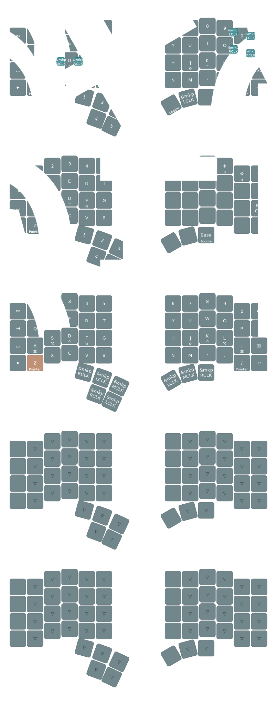

# ZMK Configuration

ZMK configuration for [charybdis nano](https://github.com/Bastardkb/Charybdis/tree/main) wireless
version with [nice!nano](https://nicekeyboards.com/nice-nano/).
now with zmk studio support!

